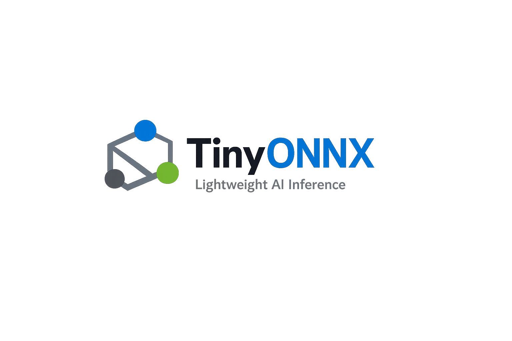
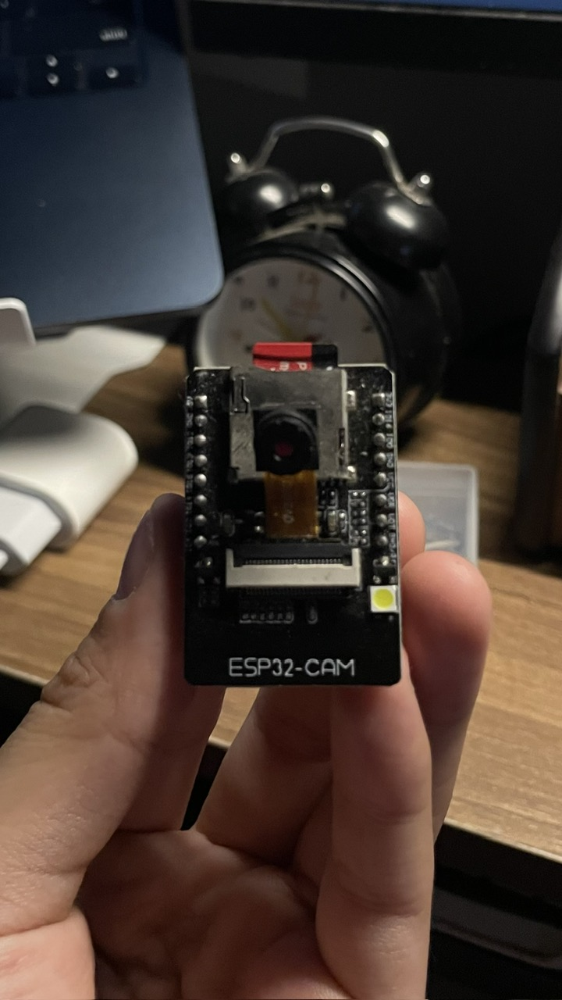
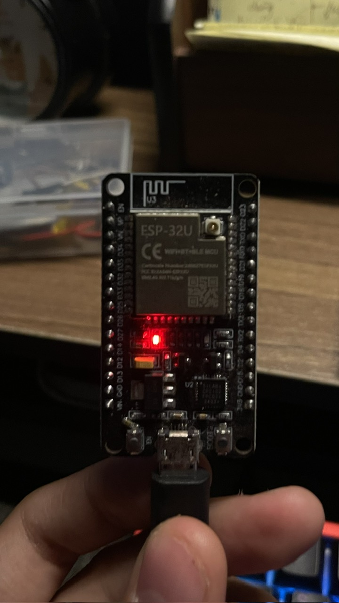
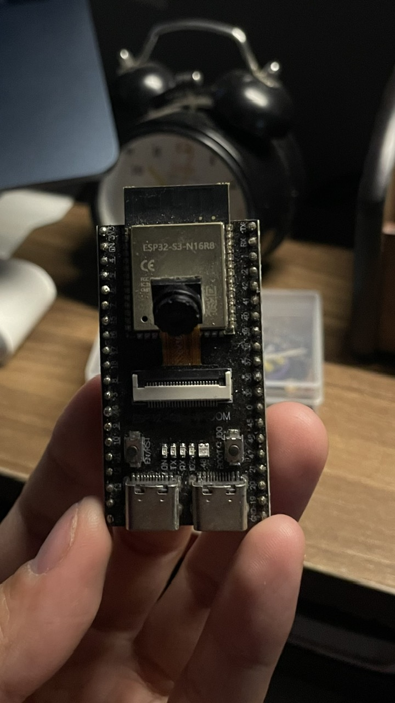

  

  <h1>TinyONNX · Mini Edge Runtime</h1>

  

    <strong>A tiny, dependency-free machine learning runtime built from scratch for learning and edge inference.</strong>
  

  

    
    
    
    
    
  

  

    <a href="#overview">Overview</a> ·
    <a href="#hardware-support">Hardware</a> ·
    <a href="#quick-start">Quick start</a> ·
    <a href="#architecture">Architecture</a> ·
    <a href="#supported-operations">Supported operations</a> ·
    <a href="#development">Development</a>
  

---

## Overview

TinyONNX is a compact implementation of an ONNX-inspired model format and inference runtime for mobile, edge, and on-device AI. The project keeps the entire execution path visible: tensors, graph validation, operator schemas, planning, kernels, and native execution.

It does **not** depend on ONNX, ONNX Runtime, NumPy, or another machine learning framework.

> [!IMPORTANT]
> TinyONNX is an educational, experimental runtime. Its JSON model format is inspired by ONNX architecture, but it is not the official ONNX wire format and is not intended for production workloads yet.

## Hardware support

| Board | Image | Progress | Documentation / example |
|---|---|---|---|
| ESP32-CAM |  | Planned; not yet validated. | Not available yet. |
| ESP32 DevKit |  | **Complete reference:** ESP-IDF build and flash verified. | [Build guide](docs/ESP32/ESP32_DEVKIT_BUILD_GUIDE.md) · [Firmware example](examples/esp32_generated_mlp/main/app_main.c) |
| ESP32-S3 |  | Planned; not yet validated. | Not available yet. |

## License

Distributed under the MIT License.

  Built to make edge inference internals small enough to understand.

